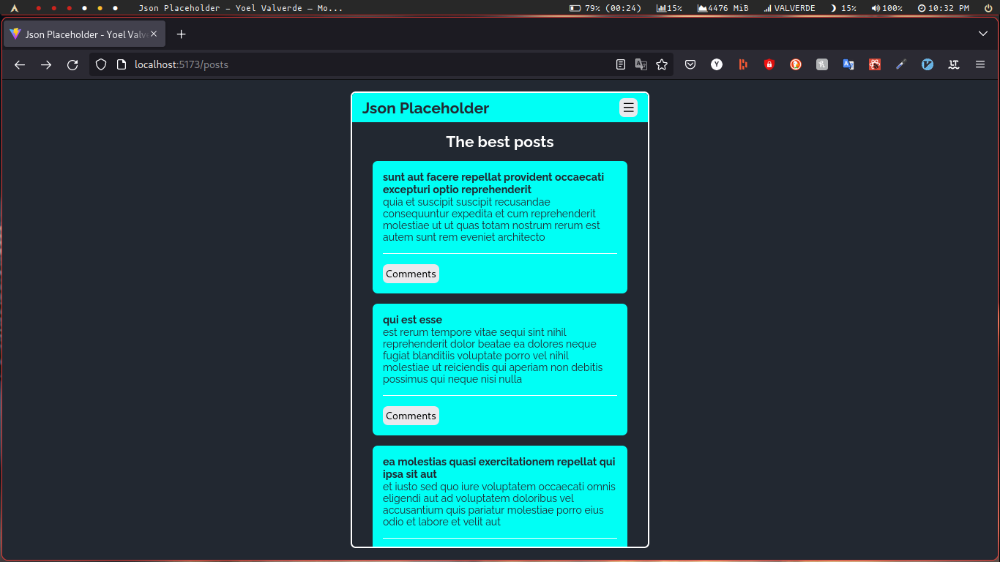
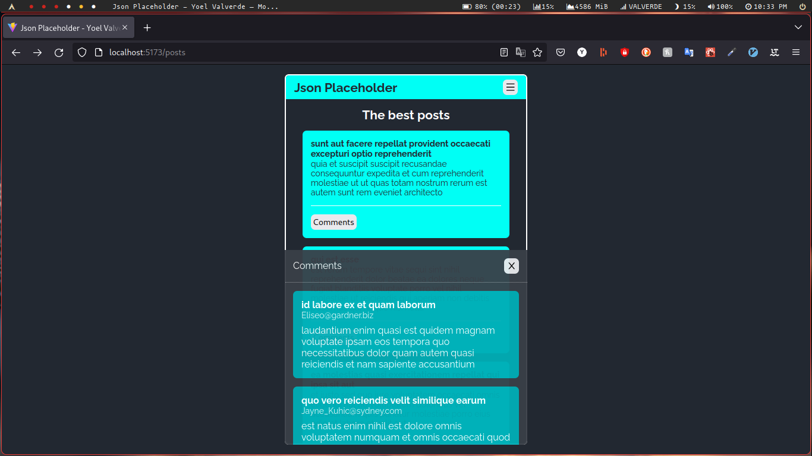

# {JSON}Placeholder
Consumo de un API donde puse a prueba todos mis conocimientos en **Javascrip**

## Instalación
Para instalar y poder ejecutar el proyecto en su equipo local, puede seguir estos pasos:
  1. Clona el repositorio `https://github.com/yoelvp/jsonplaceholder.git`
  2. Instala las dependencias del proyecto `npm install`
  3. Inicia el proyecto `npm run dev`

## Uso
La aplicaciones tiene 2 páginas, una página de inicio donde muestra información general y la otra página muestra todos **posts**

## Imágenes
  1. Consumo del endpoint **`/posts`** donde trae 100 registros, le añadí una paginación sencilla.
  

  2. Consumo del endpoint **`/posts/{postId}/comments`** Consumo de 5 comentarios por post
  

## Librerías utilizadas
  1. **`axios`** para el consumo de API
  2. **`styled-components`** para los estilos, una librería basada en componentes
  3. **`react-router-dom`** para enrutar las páginas y componentes